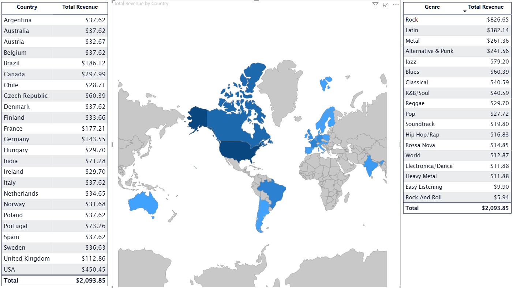
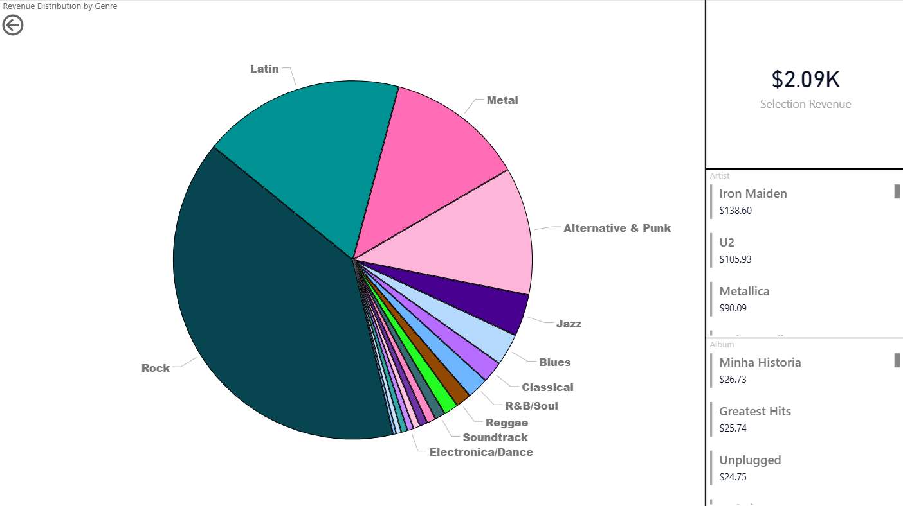

# Chinook Power BI Project

---

An **SQL** and **Power BI** project that analyzes and visualizes sales, customer, and artist data from the Chinook sample database. Designed to demonstrate data modeling, DAX measures, and interactive reporting capabilities.

---

## Features

- Connects to the Chinook database and builds interactive Power BI reports
- Uses DAX measures for key metrics like revenue, profit, and ROI
- Provides drill-through and slicer filtering for insights at multiple levels
- Visualizes customer and sales trends across different dimensions

---

## Project Background
This project was a learning exercise to practice: 
- SQL sorting and filtering
- Data modeling
- DAX calculations
- Interactive reporting in Power BI

---

## SQL

A sample query used to aggregate revenue per artist, album, genre, and customer location:

```sql
  SELECT
    i.BillingCountry,
    i.BillingCity,
    g.Name AS Genre,
    art.Name AS Artist,
    alb.Title AS AlbumTitle,
    SUM(t.UnitPrice * il.Quantity) AS TotalRevenue
  FROM
    track t
    JOIN invoiceline il ON t.TrackId = il.TrackId           
    JOIN invoice i ON il.InvoiceId = i.InvoiceId            
    JOIN album alb ON t.AlbumId = alb.AlbumId              
    JOIN artist art ON art.ArtistId = alb.ArtistId         
    JOIN genre g ON t.GenreId = g.GenreId                  
  WHERE
    t.MediaTypeId != 3                                     -- exclude video files
    AND g.GenreId NOT BETWEEN 18 AND 23                    -- exclude non-music genres
  GROUP BY
    i.BillingCountry,
    i.BillingCity,
    g.Name,
    art.Name,
    alb.Title
  ORDER BY
    i.BillingCountry,
    g.Name;
```


---


## Power BI

### Total Revenue by Country
*Clicking a country filters the data to show genre revenue within that country*  


### Total Revenue by City
*After drilling through from the country map*


### Revenue by Genre, Artist, and Album
*After drilling through from the city map*
Pie chart showing the most profitable genre, artist, and album revenue.


### Power BI Report Demo GIF


--- 

## Acknowledgements

- Chinook Sample Database: https://github.com/lerocha/chinook-database


