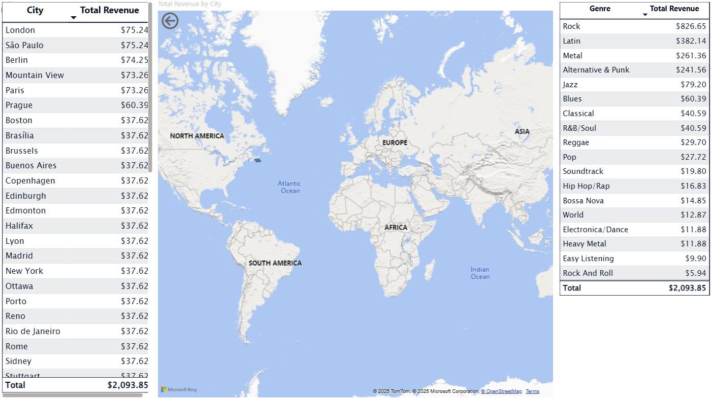

# Global Sales Analysis for the Chinook Digital Music Store

An **SQL** and **Power BI** project that analyzes and visualizes sales data from the Chinook sample database. This business intelligence dashboard was designed to answer key business questions and provide actionable insights for marketing and sales strategy. It demonstrates end-to-end skills in data modeling, SQL querying, DAX measures, and interactive reporting.

---

## The Business Problem

The executive team at the Chinook Music Store needs to make data-driven decisions for their upcoming quarterly marketing budget. They need to understand which geographic markets are generating the most revenue, which musical genres are most popular, and which artists are the top performers. The goal is to allocate marketing spend effectively to maximize Return on Investment (ROI).

---

## Actionable Insights & Recommendations

Based on the analysis, several key insights were uncovered, leading to the following strategic recommendations:

#### **Insights:**
* While the **USA is the largest market** by total revenue, countries like **Brazil, Germany, and Canada** show significant sales and high customer engagement.
* Analysis of genre performance reveals that **Rock is the dominant category**, accounting for a substantial portion of total sales across all major regions.
* Drilling down into artist performance, legacy rock bands like **Iron Maiden, U2, and Led Zeppelin** remain top revenue drivers for the store.

#### **Recommendations:**
* **Targeted Marketing Campaign:** Allocate **15% of the marketing budget** to a digital campaign focused on the Rock/Metal genres in **Brazil and Germany**, where customer spending and genre popularity are high.
* **Inventory & Promotions:** Ensure the digital catalog for top-performing rock artists is robust and consider running a **"Classic Rock Legends" promotion** to capitalize on existing, proven demand.

---

## Power BI Report Demo

The interactive dashboard allows for drilling down from a global overview to specific, granular details.

### Total Revenue by Country
*Clicking a country filters the data to show genre revenue within that country*


### Total Revenue by City
*After drilling through from the country map*


### Revenue by Genre, Artist, and Album
*After drilling through from the city map*

Pie chart showing the most profitable genre, artist, and album revenue.


### Interactive Demo GIF


---

## Technical Features

-   Connects to the Chinook database and builds interactive Power BI reports
-   Uses DAX measures for key metrics like revenue, profit, and ROI
-   Provides drill-through and slicer filtering for insights at multiple levels
-   Visualizes customer and sales trends across different dimensions

---

## SQL Query Sample

A sample query used to aggregate revenue per artist, album, genre, and customer location for ingestion into Power BI:

```sql
 SELECT
   i.BillingCountry,
   i.BillingCity,
   g.Name AS Genre,
   art.Name AS Artist,
   alb.Title AS AlbumTitle,
   SUM(t.UnitPrice * il.Quantity) AS TotalRevenue
 FROM
   track t
   JOIN invoiceline il ON t.TrackId = il.TrackId          
   JOIN invoice i ON il.InvoiceId = i.InvoiceId            
   JOIN album alb ON t.AlbumId = alb.AlbumId               
   JOIN artist art ON art.ArtistId = alb.ArtistId        
   JOIN genre g ON t.GenreId = g.GenreId                  
 WHERE
   t.MediaTypeId != 3                                      -- exclude video files
   AND g.GenreId NOT BETWEEN 18 AND 23                     -- exclude non-music genres
 GROUP BY
   i.BillingCountry,
   i.BillingCity,
   g.Name,
   art.Name,
   alb.Title
 ORDER BY
   i.BillingCountry,
   g.Name;
```
   
## Acknowledgements

Assistance with coding, Excel formulas, and Python scripting was obtained from AI tools including:

- **ChatGPT (GPT-5-mini)**
- **Gemini (2.5 Flash)**
- **Claude (Sonnet 4)** — provided the most accurate and complete guidance
 

All code was actively developed and refined with human oversight — issues were identified and corrected during the process.